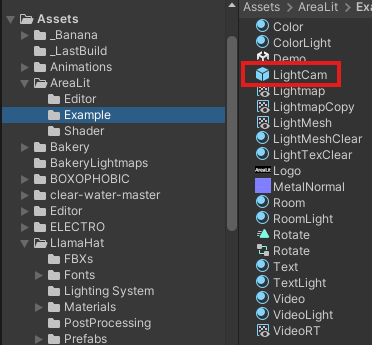
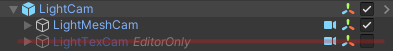
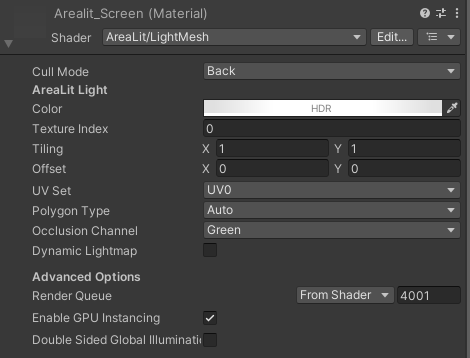
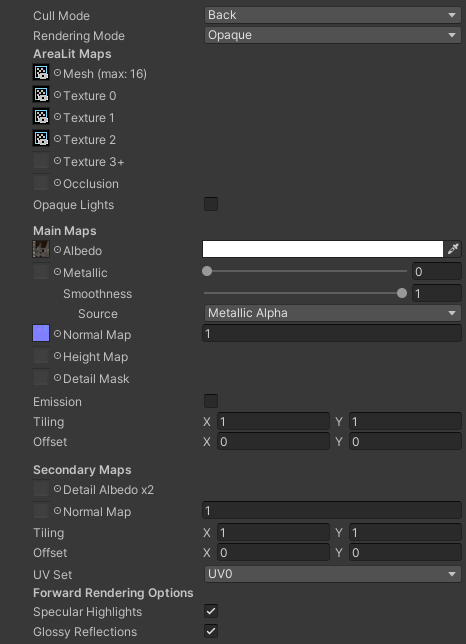
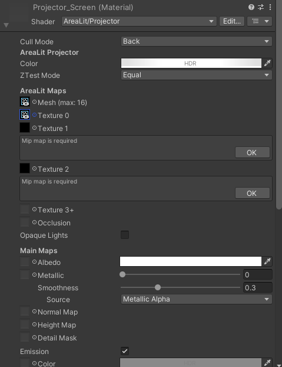
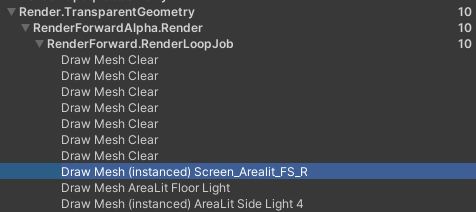

# Setting Up Arealit

## Introduction
This guide will walk you through the steps to set up Arealit, a GI system for realtime reflections and global illumination specifically designed for VRChat in Unity.

## Prerequisites
Before you begin, ensure you have the following:
- Unity version compatible with VRChat (check VRChat's documentation for the latest supported version).
- VRChat SDK installed in your Unity project.
- Arealit package downloaded from the official source. [Link to Arealit download page](https://booth.pm/en/items/3661829)
  - v1.0.5 fixes issues with previous versions, so make sure to get the latest version.
- Basic understanding of Unity and VRChat world creation.

## Understanding Arealit
Arealit is a global illumination system that uses a camera to capture light information from specific sources in your scene and applies that information to materials using specialized shaders. This allows for dynamic lighting effects that can enhance the visual quality of your VRChat worlds.

It is composed of three main components:
1. **Arealit Mesh Camera**: A camera that captures the light information from designated sources in the scene.
2. **Arealit Mesh Material**: A material that is applied to a mesh, which the Mesh Camera captures to generate a texture for the Arealit shader.
3. **Arealit Shaders**: Custom shaders that utilize the texture generated by the Mesh Camera to apply global illumination effects to materials.

With all three of these components working together, you can create dynamic and immersive lighting effects in your VRChat worlds.

## Simple Setup Guide
This guide will help you setup a basic Arealit GI system in your VRChat world. It assumes that you have a video player or some other texture source that you want to use as an area light type GI source. This type of setup is ideal for screens, billboards, and other flat surfaces that emit light.

1. Import Arealit Package
   1. Open your Unity project where you want to set up Arealit.
   2. Import the Arealit package by dragging and dropping the downloaded package into the unity editor, or double clicking the package file in your file explorer.
   3. After importing, you should see an "Arealit" folder in your Project window.

2. Arealit Mesh Camera Setup
   1. In the Project window, navigate to `Arealit/Example`.
   2. Drag in the `LightCam` prefab into your scene.
        
        
      - This prefab contains the camera which will capture the GI souces, and generate a texture for the Arealit shader to use.
  
   3. Position the `LightCam` in your scene. It should be placed and sized where it can capture the areas you want to be affected by GI, specifically the areas where your GI sources are located.
      - Note that the camera will need to be sized by adjusting the orthographic size and clipping planes to cover the area you want to be lit.
   4. For most use cases, you will only need the `LightMeshCam` portion of this prefab. You can delete the `LightTexCam` if you do not plan to use it.
        
        

3. Arealit Sources Setup
   1. Arealit requires a specific setup in your scene. You will need to add a quad object to act as a source for the GI.
   2. Create a new Quad in your scene:
      - Right-click in the Hierarchy window.
      - Select `3D Object` > `Quad`.
      - Rename it to `Arealit_GI_Source` or something similar.
   3. Position the Quad in your scene where you want the GI to originate from. This could be above your main screen in the world or any other strategic location.
   4. This object will need to be set to layer "TranspartentFX" to work correctly with Arealit.

4. Arealit Mesh Material
   1. Create a new material for the Arealit Mesh:
        1. Right-click in the Project window.
        2. Select `Create` > `Material`.
        3. Name it `Arealit_Mesh_Material` or something similar.
        4. Apply the `Arealit/LightMesh` shader to this material.
   2. Select your `Arealit_GI_Source` quad in the Hierarchy and apply the `Arealit_Mesh_Material` to it by dragging and dropping the material onto the quad in the Scene or Hierarchy view.
   
        
    
    - This material is responsible for capturing the GI information and sending it to the Arealit Shader.
    - The `Color` property, tints the output of the GI, this means that if there is a texture applied to the quad, the color will multiply with the texture colors.
    - The `Texture Index` property assigns which texture slot of the Arealit shader this source will project outward into the scene. This allows for multiple GI sources to be used in the same scene.
      - Quick tip, if you want to view where the GI is being projected from, you can set the `Texture Index` to `-1`, this will output just the base color of the GI source directly in the scene. This can also be helpful for debugging why Arealit isn't working as expected.

5. Assign Arealit Shaders to Materials
   1. Select the materials you want to be affected by Arealit GI.
   2. In the Inspector window, change the shader to one of the Arealit shaders:
      - For example, you can use `Arealit/Standard` but a list of compatible shaders can be found below:
        - Mochie Shaders [https://github.com/MochiesCode/Mochies-Unity-Shaders/releases]
        - ORL Shaders [https://shaders.orels.sh/]
        - Z3Y Shaders [https://github.com/z3y/Graphlit]
   3.  The shader offers a few bits that will need to be filled in.
       1. The `Mesh` field should point to the output texture of the `LightMeshCam`, this is preconfigured in the prefab to be named `LightMesh`.
       2. The `Texture 0` field is the main GI texture source, this could be your video player render texture or any other texture you want to use as a GI source.
        
        

6. Setting up the avatar projector
   1. Go into the `Demo` scene found in `Arealit/Example` and joink the projector setup from that scene into your own scene.
   2. Similar to the Arealit Standard shader, the projector needs to have the `LightMesh` texture assigned to it and the main textures assigned to the correct slots.
   
        

    - The way that the projector works is by multiplying the light information from the Arealit system onto the existing scene lighting, giving a more dynamic and immersive lighting effect. But what this means is that if there is nothing from Arealit to multiply onto the scene, the projector will multiply by black and result is no avatar lighting.
    - To fix this, use the `emission` property of the projector material to add a base level of light to the scene. This will ensure that even when there is nothing from Arealit, the project will still contribute the base light level to the avatars in the scene.

## Optimizations of Arealit
- Arealit is designed to be efficient, but there are things that can be done to make it run smoother:

### LightMeshCam Optimizations
The LightMeshCam basically looks at where the GI sources are, and generates a texture that tells the Arealit shader where in the world the sources are coming from. If these sources don't change, ie, if you have static screens or lights, then this camera doesn't need to update every frame.

To optimize this you can disable the GameObject after the initial read. This will stop it from updating every frame, and save on performance.

Another optimization is listed in Simple Setup Guide step 2.4, where you can delete the LightTexCam if you don't plan to use it. This camera is only needed if you want to do indirect lighting with Arealit, which is really not recommended for VRChat due to performance concerns.

### LightMesh Material Optimizations
The Arealit Mesh Material can be optimized through GPU instancing, which can be enabled in the material settings. This allows multiple Arealit Mesh materials to share the same draw call as can be seen in [this image](../assets/images/ArealitMeshCamFrameDebug.png).

### Opaque Lights Toggle
This toggle is found in the Arealit Standard shader. Enabling this will make sure that lights do not overlap ontop of eachother, depending on the setup you have this may be helpful or not. Test both settings to see which looks best and which performs better for your use case.

Most of the time I simply leave this off, as having a red and a blue light overlap can create a nice purple giving variation to the lighting.